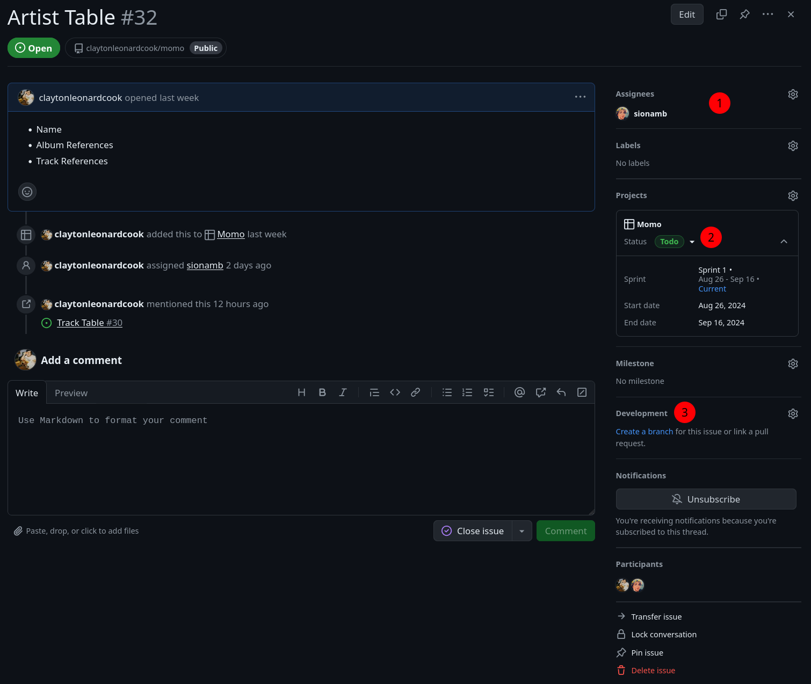

# Momo

Momo is a open source, desktop, music player.

<!-- TODO: Add screenshots and showcase features once we have them.  -->

## Quickstart

### Install the Coding Profile

1. Press `Ctrl + Shift + P`
2. Type `Import Profile`
3. Select `Profiles: Import Profile...`
4. Select `Select File...`
5. Navigate to the project and select `momo.code-profile` that's in the `.vscode` folder.
6. Select `Create Profile`

The code profile will then install with all the proper extensions and configurations set. We use code profiles so that everyone has a relatively similar coding experience. You're free to install any other extensions after installing the code profile.

### Prerequisites

Go to [tauri.app](https://tauri.app/v1/guides/getting-started/prerequisites) and go through the prerequisites process based on your operating system.

### Installing & Running

Now, open a VSCode terminal and run:

```sh
npm install
```

and then if you're trying to do fast development then run:

```sh
npm run dev
```

This will allow you to go to [localhost:1420](http://localhost:1420) and develope via the browser.

If you want to get a full desktop dev environment then run:

```sh
npm run tauri dev
```

This will open the application in it's own window.

_Also, if you right click in this window you can inspect it as if you were in a normal web browser._

If you want to build the application, follow the build instructions for your operating system on [tauri.app](https://tauri.app/v1/guides/building/).

## Workflow

There are a couple ways you could go through the workflow but I'll just be putting the main one that I think gives the best visibility.

1. Go to the [project khanban board](https://github.com/users/claytonleonardcook/projects/3/views/4).
2. Select a ticket from `Todo` that you're assigned too.
   - _If you're not assigned to any tickets grab one and assign yourself to it if it's in your wheel house._
3. Move the ticket from `Todo` to `In Progress`.
4. Create a branch using the `Create a branch` link under `Deployment`.
   - _I prefer we don't edit the branch names and go with the auto-generated ones._
5. Switch to that branch in your VSCode and start working.
   - _Make sure to make small incremental commits when you can. It's nice to see progress and it makes rebasing easier later._
6. Once you think you're done with your work, go to the [PR tab](https://github.com/claytonleonardcook/momo/pulls) and open a PR of your branch to main.
7. Attach the `Review` label to the PR for visibility.
   - _If you're not ready for a review just remove the `Review` label and attach the `DO NOT MERGE` label._
8. Once someone reviews your PR, check to see if they open any conversations about what they think might need to be changed.
   - \*If you think it's unnecessary then comment why you think so.\*\*
   - _If it is worth fixing, go ahead and make a commit to fix it and request another review._
   - **IMPORTANT: You should never resolve any comments on your PR that weren't made by you. The original reviewer needs to resolve them if you fixed it or a comment was made about why it wasn't fixed.**
9. If all comments have been resolved, the reviewer will attach the `Rebase & Merge` label. Once you see this you're free to rebase and merge into main.
   - _To rebase run `git fetch origin` to update all current branches if there were any changes. Then run `git rebase main` while on your branch. You may need to resolve merge conflicts but once you do you can run `git push --force`._
   - _After rebasing, you can then go back to your PR and click on the `Rebase and Merge` button at the bottom. You may need to click on the arrow next to it to select that option._
10. Once everything is merged, pick up another ticket and repeat the process.



> 1. Assign youself or other's to a ticket.
> 2. Change status of ticket.
>    - _You can also just drag and drop on the main khanban board._
> 3. Create branch for the ticket.
>    - _Select `Create a branch` and it should bring up a dialog. You shouldn't have to change anything on it and can go ahead and select `Create Branch`._
>    - _If you end up doing two tickets on one branch you can click the gear icon and select from any open PRs to attach the ticket to. This is nice because once the PR is merged it'll move it to `Done`._
